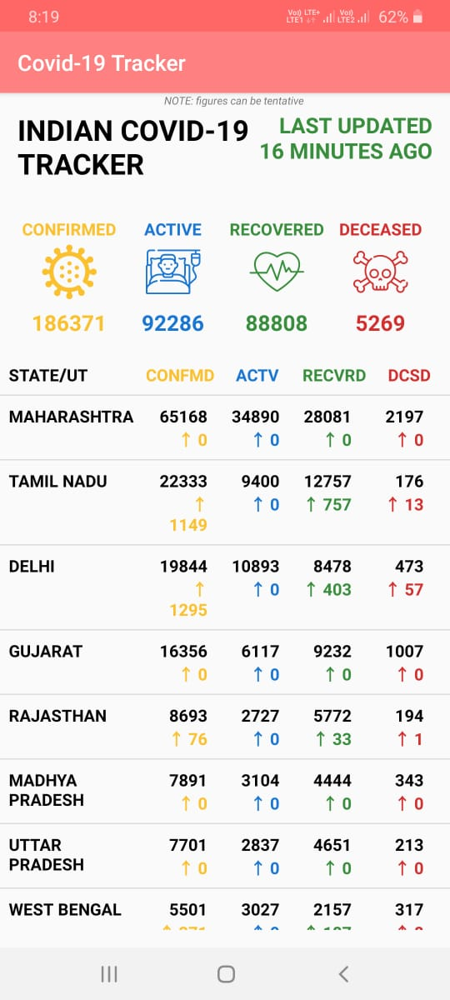

# COVID-19-Stats-Android-App
It's a COVID-19 Statistics displayer app that shows realtime statistics in which last updated data counter is also displayed . The data is fetched from two different APIs and displayed on the app with variety of differentiations. 

## Motivation
It is a personal project developed by me in Android Studio using Kotlin. It is basically developed for learning new skill in Kotlin by having a overview on the language and implementing the experience.

## Tech/framework used

<b>Built with</b>
- [Kotlin](https://kotlinlang.org/)
- [Android Studio](https://developer.android.com/studio)

## Screenshot

## License
[MIT](https://choosealicense.com/licenses/mit/)
